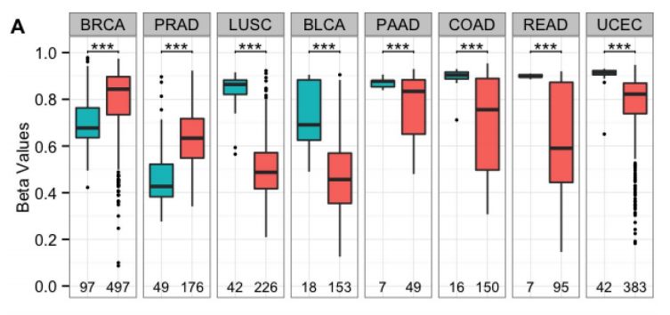

```{r setup, include=FALSE}
knitr::opts_chunk$set(cache=TRUE)
```
 
## Introduction:

The purpose of this protocol is to serve as a guide for analyzing 450k Illumina Human Methylation data to find differences in methylation at the base pair, promoter, gene levels. Following along with past research findings of differentially methylated locations, the TRIM29 gene and other transcription regulators between various solid tissue samples, including breast (BRCA), and colon (COAD), and lung (LUSC), and between normal and tumor breast (BRCA) samples are observed. The TRIM29 gene is of interest because of its opposing functions in various cancers. In breast cancers, it acts as a tumor suppressor, and in others including lung cancers, it acts as an oncogene.  
     
The reference for the research mentioned is:

* Avraham A, Cho SS, Uhlmann R, Polak ML, Sandbank J, Karni T, et al. (2014) Tissue Specific DNA Methylation in Normal Human Breast Epithelium and in Breast Cancer. PLoS ONE 9(3): e91805. doi:10.1371/journal.pone.0091805

We will use mainly the minfi and epivizr packages in Bioconductor. The minfi package is used to do the analyses requiring the identification of differentially methylated positions, regions, and blocks. The epivizr package is used to serve data generated in R to the Epiviz workspace, which is used as an interactive genomic visualization tool. This protocol aims to walk through the analysis and visualization of the Illumina Infinium Human Methylation 450k data from the Cancer Genome Atlas (TCGA) project.

## Motivation:

#### Tissue Specific DNA Methylation in Normal Human Breast Epithelium and in Breast Cancer (Avraham et al., 2014)

Research findings from Avraham et al. in 2014 conclude that the TRIpartite Motif-containing 29 (TRIM29), also called the ataxia telangiectasia group D-complementing (ATDC), has differing functions in various cancer types. In breast cancer, the expression of TRIM29 is less than the expression in normal breast tissue, and it acts as a tumor suppressor. The promoter of the gene is hypo-methylated in normal breast tissue, but hyper-methylated in other normal tissues, like the colon, lung, and endometrium, where it is oncogenic. In tumor breast tissues, the methylation increased and expression decreased when compared with normal breast tissues. In comparisons between other cancer types and their respective normal tissues, the opposite methylation pattern was observed.   

The researchers identified 110 genes that were differentially methylated in the breast compared to all other epithelial tissues tested. Of these 110 genes, a group 15 of them were DNA binding and transcription regulators, which were found to have a notable relevance to cancer. Their analysis of TCGA data for these genes, including ALX4, GATA5, MGMT, NEUROG1, SOX10, SREBP1, ST18, TRIM29, and TP73, revealed methylation differences at most of the corresponding loci between normal and tumor breast samples. The methylation pattern also varied between breast cancer types, including basal, luminal-A and luminal-B, and between different normal tissue types, identifying these gene regions as differentially methylated regions (DMRs). The TRIM29 gene has a CpG island at the transcription start site of the gene (between 120,008,000 and 120,009,000 on chromosome 11). 

In breast tissues, it was found that this CpG island was hypo-methylated methylation, and in other tissues, including colon and lung, it has full methylation. These results were found analyzing Illumina-Infinium HumanMethylation27 array data.  TRIM29 expression was higher in normal breast tissues than in other normal tissues tested. The main conlcusion proposed by authors was that, "Epigenetic alterations affecting tissue-specific differentiation are the predominant mechanism by which epigenetic changes cause cancer." Although the findings of the research were interesting, the paper lacked good visualizations of the 450k Illumina Human Methylation data, and the goal of this protocol is to provide a better one that can also be used to view other genes of interest in any cancer type, as the data is available for the whole genome.

## 1. Getting Started

Install the needed packages in R: Bioconductor, minfi, epivizr, GenomicFeatures, BSgenome.Hsapiens.UCSC.hg19, and TxDb.Hsapiens.UCSC.hg19.knownGene  

```{r,eval=F}
source("http://bioconductor.org/biocLite.R")
biocLite("minfi")
biocLite("epivizr")
biocLite("GenomicFeatures")
biocLite("BSgenome.Hsapiens.UCSC.hg19")
biocLite("TxDb.Hsapiens.UCSC.hg19.knownGene")
```

## 2. Gather Data

The data used in this protocol is 450k Illumina Human Methylation data from the Cancer Genome Atlas (TCGA) project. In order to analyze the data and prepare it for visualization in Epiviz, it must first be loaded into R. There were four different types of 450k samples used, as shown in the chart below, so that methylation analyses could be done between the three normal samples and the normal and tumor BRCA samples, separately.

Cancer Type | Tissue | # Normal Samples | # Tumor Samples
----------- | ------ | ---------------- | -------------
BRCA        | breast | 15               | 15
COAD        | colon  | 15               | 0
LUSC        | lung   | 15               | 0

The data can be downloaded using the data matrix in TCGA's data portal, found here:

* https://tcga-data.nci.nih.gov/tcga/dataAccessMatrix.htm

When selecting the data, be sure to choose only the samples that end in 01 (TCGA-..-....-01) for solid tissue tumor types and samples that end in 11 (TCGA-..-....-11) for solid tissue normal types. For each cancer type, once the correct settings are selected, click the "Build Archive" button and then download the data. The settings used for the data matrix page and the specific TCGA samples chosen are shown in the following screenshots:

Cancer Type | Filter Settings                                | Samples                                          
----------- | ---------------                                | --------------                                         
BRCA normal |  | 
BRCA tumor  |  | 
COAD normal |  | 
LUSC normal |  | 

After unzipping the files that are sent to the email of your choice, save each cancer type (BRCA, COAD, LUSC) as different folders under a new directory, like "datadir" shown below.

Load breast tumor and breast normal data.

```{r,eval=T}
library(minfi)
datadir <- "/Users/mwalter/Documents/methylation_files/breast"

clinicalDir <- file.path(datadir,"Clinical/Biotab")
sample_tab <- read.delim(file.path(clinicalDir,"nationwidechildrens.org_biospecimen_sample_brca.txt"),sep="\t",stringsAsFactors=FALSE)
keep <- sample_tab$sample_type %in% c("Primary Tumor", "Solid Tissue Normal")
sample_tab <- sample_tab[keep,]

patient_id <- unique(sapply(strsplit(sample_tab$bcr_sample_barcode,split="-"), function(x) paste(x[1:3],collapse="-")))

tumor_sample_id <- sample_tab$bcr_sample_uuid[sample_tab$sample_type=="Primary Tumor"]
normal_sample_id <- sample_tab$bcr_sample_uuid[sample_tab$sample_type=="Solid Tissue Normal"]

# read tumor data
tumor_tab <- read.delim(file.path(clinicalDir,"nationwidechildrens.org_biospecimen_tumor_sample_brca.txt"),sep="\t",stringsAsFactors=FALSE)

tab <- merge(sample_tab, tumor_tab, by="bcr_sample_uuid", suffixes=c(".sample",".tumor"),all.x=TRUE)

# read normal data
normal_tab <- read.delim(file.path(clinicalDir,"nationwidechildrens.org_biospecimen_normal_control_brca.txt"),sep="\t",stringsAsFactors=FALSE)
tab <- merge(tab, normal_tab, by="bcr_sample_uuid", suffixes=c(".tumor",".normal"),all.x=TRUE)

tab$bcr_patient_barcode <- tab$bcr_patient_barcode.tumor

ii <- is.na(tab$bcr_patient_barcode)
tab$bcr_patient_barcode[ii] <- tab$bcr_patient_barcode.normal[ii]

# read patient data
patient_tab <- read.delim(file.path(clinicalDir,"nationwidechildrens.org_clinical_patient_brca.txt"),sep="\t",stringsAsFactors=FALSE)
names(patient_tab) <- paste("patient",names(patient_tab),sep=".")
tmp <- merge(tab,patient_tab,by.x="bcr_patient_barcode",by.y="patient.bcr_patient_barcode",all.x=TRUE,suffixes=c(".sample",".patient"))
tab <- tmp

# read meth metadata
methMetaDir <- file.path(datadir,"METADATA/JHU_USC__HumanMethylation450")
methMeta_tab <- read.delim(file.path(methMetaDir,"jhu-usc.edu_BRCA.HumanMethylation450.1.9.0.sdrf.txt"),sep="\t",stringsAsFactors=FALSE)

sample_barcode <- sapply(strsplit(methMeta_tab$Comment..TCGA.Barcode.,split="-"),function(x) paste(x[1:4],collapse="-"))
m <- match(tab$bcr_sample_barcode,sample_barcode)
tab$Basename <- gsub("_Grn\\.idat","",methMeta_tab$Array.Data.File[m])
tab <- tab[!is.na(tab$Basename),]

basedir <- file.path(datadir,"DNA_Methylation/JHU_USC__HumanMethylation450/Level_1")
tab$Basename <- file.path(basedir,tab$Basename)
keep <- file.exists(paste(tab$Basename,"_Grn.idat",sep=""))
breast_targets <- tab
objs <- grep("tab",ls(),value=TRUE)
rm(list=objs)
objs <- grep("dir",ls(),value=TRUE,ignore=TRUE)
rm(list=objs)

nms <- names(breast_targets)
targets.breast <- breast_targets[nms]

targets.breast$Status <- factor(ifelse(targets.breast$sample_type=="Primary Tumor","cancer","normal"),levels=c("normal","cancer"))
targets.breast$Tissue <- tolower(targets.breast$patient.tumor_tissue_site)
targets.breast$Sex <- targets.breast$patient.gender
```

Load colon normal data.

```{r,eval=T}
datadir <- "/Users/mwalter/Documents/methylation_files/colon"

clinicalDir <- file.path(datadir,"Clinical/Biotab")
sample_tab <- read.delim(file.path(clinicalDir,"nationwidechildrens.org_biospecimen_sample_coad.txt"),sep="\t",stringsAsFactors=FALSE)
keep <- sample_tab$sample_type %in% c("Primary Tumor", "Solid Tissue Normal")
sample_tab <- sample_tab[keep,]

patient_id <- unique(sapply(strsplit(sample_tab$bcr_sample_barcode,split="-"), function(x) paste(x[1:3],collapse="-")))

tumor_sample_id <- sample_tab$bcr_sample_uuid[sample_tab$sample_type=="Primary Tumor"]
normal_sample_id <- sample_tab$bcr_sample_uuid[sample_tab$sample_type=="Solid Tissue Normal"]

# read tumor data
tumor_tab <- read.delim(file.path(clinicalDir,"nationwidechildrens.org_biospecimen_tumor_sample_coad.txt"),sep="\t",stringsAsFactors=FALSE)

tab <- merge(sample_tab, tumor_tab, by="bcr_sample_uuid", suffixes=c(".sample",".tumor"),all.x=TRUE)

# read normal data
normal_tab <- read.delim(file.path(clinicalDir,"nationwidechildrens.org_biospecimen_normal_control_coad.txt"),sep="\t",stringsAsFactors=FALSE)
tab <- merge(tab, normal_tab, by="bcr_sample_uuid", suffixes=c(".tumor",".normal"),all.x=TRUE)

tab$bcr_patient_barcode <- tab$bcr_patient_barcode.tumor

ii <- is.na(tab$bcr_patient_barcode)
tab$bcr_patient_barcode[ii] <- tab$bcr_patient_barcode.normal[ii]

# read patient data
patient_tab <- read.delim(file.path(clinicalDir,"nationwidechildrens.org_clinical_patient_coad.txt"),sep="\t",stringsAsFactors=FALSE)
names(patient_tab) <- paste("patient",names(patient_tab),sep=".")
tmp <- merge(tab,patient_tab,by.x="bcr_patient_barcode",by.y="patient.bcr_patient_barcode",all.x=TRUE,suffixes=c(".sample",".patient"))
tab <- tmp

# read meth metadata
methMetaDir <- file.path(datadir,"METADATA/JHU_USC__HumanMethylation450")
methMeta_tab <- read.delim(file.path(methMetaDir,"jhu-usc.edu_COAD.HumanMethylation450.1.9.0.sdrf.txt"),sep="\t",stringsAsFactors=FALSE)

sample_barcode <- sapply(strsplit(methMeta_tab$Comment..TCGA.Barcode.,split="-"),function(x) paste(x[1:4],collapse="-"))
m <- match(tab$bcr_sample_barcode,sample_barcode)
tab$Basename <- gsub("_Grn\\.idat","",methMeta_tab$Array.Data.File[m])
tab <- tab[!is.na(tab$Basename),]

basedir <- file.path(datadir,"DNA_Methylation/JHU_USC__HumanMethylation450/Level_1")
tab$Basename <- file.path(basedir,tab$Basename)
keep <- file.exists(paste(tab$Basename,"_Grn.idat",sep=""))
colon_targets <- tab
objs <- grep("tab",ls(),value=TRUE)
rm(list=objs)
objs <- grep("dir",ls(),value=TRUE,ignore=TRUE)
rm(list=objs)

nms <- names(colon_targets)
targets.colon <- colon_targets[nms]

targets.colon$Status <- factor(ifelse(targets.colon$sample_type=="Primary Tumor","cancer","normal"),levels=c("normal","cancer"))
targets.colon$Tissue <- tolower(targets.colon$patient.tumor_tissue_site)
targets.colon$Sex <- targets.colon$patient.gender
```

Load lung normal data.

```{r,eval=T}
datadir <- "/Users/mwalter/Documents/methylation_files/lung"


clinicalDir <- file.path(datadir,"Clinical/Biotab")
sample_tab <- read.delim(file.path(clinicalDir,"nationwidechildrens.org_biospecimen_sample_lusc.txt"),sep="\t",stringsAsFactors=FALSE)
keep <- sample_tab$sample_type %in% c("Primary Tumor", "Solid Tissue Normal")
sample_tab <- sample_tab[keep,]

patient_id <- unique(sapply(strsplit(sample_tab$bcr_sample_barcode,split="-"), function(x) paste(x[1:3],collapse="-")))

tumor_sample_id <- sample_tab$bcr_sample_uuid[sample_tab$sample_type=="Primary Tumor"]
normal_sample_id <- sample_tab$bcr_sample_uuid[sample_tab$sample_type=="Solid Tissue Normal"]

# read tumor data
tumor_tab <- read.delim(file.path(clinicalDir,"nationwidechildrens.org_biospecimen_tumor_sample_lusc.txt"),sep="\t",stringsAsFactors=FALSE)

tab <- merge(sample_tab, tumor_tab, by="bcr_sample_uuid", suffixes=c(".sample",".tumor"),all.x=TRUE)

# read normal data
normal_tab <- read.delim(file.path(clinicalDir,"nationwidechildrens.org_biospecimen_normal_control_lusc.txt"),sep="\t",stringsAsFactors=FALSE)
tab <- merge(tab, normal_tab, by="bcr_sample_uuid", suffixes=c(".tumor",".normal"),all.x=TRUE)

tab$bcr_patient_barcode <- tab$bcr_patient_barcode.tumor

ii <- is.na(tab$bcr_patient_barcode)
tab$bcr_patient_barcode[ii] <- tab$bcr_patient_barcode.normal[ii]

# read patient data
patient_tab <- read.delim(file.path(clinicalDir,"nationwidechildrens.org_clinical_patient_lusc.txt"),sep="\t",stringsAsFactors=FALSE)
names(patient_tab) <- paste("patient",names(patient_tab),sep=".")
tmp <- merge(tab,patient_tab,by.x="bcr_patient_barcode",by.y="patient.bcr_patient_barcode",all.x=TRUE,suffixes=c(".sample",".patient"))
tab <- tmp

# read meth metadata
methMetaDir <- file.path(datadir,"METADATA/JHU_USC__HumanMethylation450")
methMeta_tab <- read.delim(file.path(methMetaDir,"jhu-usc.edu_LUSC.HumanMethylation450.1.7.0.sdrf.txt"),sep="\t",stringsAsFactors=FALSE)

sample_barcode <- sapply(strsplit(methMeta_tab$Comment..TCGA.Barcode.,split="-"),function(x) paste(x[1:4],collapse="-"))
m <- match(tab$bcr_sample_barcode,sample_barcode)
tab$Basename <- gsub("_Grn\\.idat","",methMeta_tab$Array.Data.File[m])
tab <- tab[!is.na(tab$Basename),]

basedir <- file.path(datadir,"DNA_Methylation/JHU_USC__HumanMethylation450/Level_1")
tab$Basename <- file.path(basedir,tab$Basename)
keep <- file.exists(paste(tab$Basename,"_Grn.idat",sep=""))
lung_targets <- tab
objs <- grep("tab",ls(),value=TRUE)
rm(list=objs)
objs <- grep("dir",ls(),value=TRUE,ignore=TRUE)
rm(list=objs)

nms <- names(lung_targets)
targets.lung <- lung_targets[nms]

targets.lung$Status <- factor(ifelse(targets.lung$sample_type=="Primary Tumor","cancer","normal"),levels=c("normal","cancer"))
targets.lung$Tissue <- tolower(targets.lung$patient.tumor_tissue_site)
targets.lung$Sex <- targets.lung$patient.gender

rm(list=ls()[!(ls() %in% c('targets.breast','targets.colon','targets.lung'))])
```

Merge and read data from BRCA, COAD, and LUSC samples     .

```{r,eval=T}
merge <- merge(targets.breast,targets.colon,all=TRUE)
targets <- merge(merge,targets.lung,all=TRUE)
targets <- targets[which(file.exists(paste0(targets$Basename,"_Grn.idat"))),]

memory.limit(size=10000)
rg.set <- read.450k(targets$Basename,verbose=TRUE)
pData(rg.set) <- targets

table(targets$Tissue,targets$Status)
```

## 3. Preprocessing

We now have an RGChannelSet that was created from reading the downloaded IDAT files. Next, the data needs to be processed into usable objects for various functions in the minfi package to work properly. The object classes to be used are the RGChannelSet, MethylSet, GenomicMethylSet, RatioSet, or GenomicRatioSet, which all represent different forms of information from the 450k experiment. Most of the analysis will be done on the GenomicRatioSet datatype. To preprocess the data minfi's variety of preprocess...() functions are used to convert the data sets into usable R objects.

Data Input             | Processing Function    | Output           | Analytic Use
---------------------- | ---------------------- | ---------------- | --------------------------
Raw data (IDAT files)  | read.450k.exp()        | RGChannelSet     | output of reading data   
RGChannelSet           | preprocessIllumina()   | MethylSet        | dmpFinder method
MethylSet              | mapToGenome()          | GenomicMethylSet | blockFinder method
GenomicMethylSet       | ratioConvert()         | GenomicRatioSet  | bumphunter method

These steps make a GenomicRatioSet out of a RGChannelSet.

```{r,eval=T}
meth.set <- preprocessIllumina(rg.set)
gen.meth.set <- mapToGenome(meth.set)
gen.rat.set <- ratioConvert(gen.meth.set,type="Illumina")
```

## 4. DMP Visualization

#### Load Epiviz Workspace #1:

Start Epiviz in the web, beginning from a pre-existing workspace that contains a "Genes" track, "CpG Islands" track, and a Gene Expression Barcode data heatmap of the four sample types. It is possible to start a new workspace from scratch, however, the gene, cpg island, and heatmap data will not be available in it.

```{r, eval=T}
require(epivizr)
mgr <- startEpiviz(workspace="GpnylaSdPmn",tryPorts=TRUE)
```
 
If you are using a Windows machine and the data is not changing while interacting with the Epiviz interface, enter the following into the console to make the added charts connect properly.

```{r,eval=T}
#mgr$service()
```

#### Analysis in R:

Epiviz charts needed for DMP visualization:

* Gene Expression Barcode heatmap
* Methylation MA scatter plot
* Genes genes track
* CpG island blocks track
* Promoters blocks track
* Differentially methylated positions blocks track
* P-value stacked track
* Beta methylation value line track

Find and add promoter regions to workspace as a blocks track.

```{r,eval=T}
library(GenomicFeatures)
library(TxDb.Hsapiens.UCSC.hg19.knownGene)
promoter.regions <- promoters(TxDb.Hsapiens.UCSC.hg19.knownGene,upstream=2000,downstream=200)
promoters <- mgr$addDevice(promoter.regions, "Promoters")
```

Minfi's main function to find differentially methylated positions is "dmpFinder". It uses single probe analysis on CpGs to find methylation differences and an F-test between two groups of different phenotypes to determine which CpG loci are differentially methylated (in this case between BRCA normal and tumor samples). In Epiviz, add a blocks track to show the location of the DMPs with respect to all other charts.

```{r,eval=T}
library(doParallel)
cores <- detectCores()
registerDoParallel(cores)
meth.set.breast <- meth.set[,which(meth.set$Tissue=="breast")]
dmp <- dmpFinder(meth.set.breast,meth.set.breast$Status,type="categorical")
head(dmp)
dmp.gr <- granges(gen.meth.set[rownames(dmp)])
dmps <- mgr$addDevice(dmp.gr, "Differentially Methylated Positions")
```

Add the p-value data as an EpivizBpData datatype so that is can be used in different track types. 

```{r, eval=T}
dmp.gr$pval <- -log10(dmp$pval)
pvals <- mgr$addMeasurements(dmp.gr, "P-Values (-log10) of DMPs",type="bp",columns="pval")
```

Now that the p-value measurements have been added, add a stacked track of the p-values to show which DMPs are significant, using the "Visualizations" button. The measurement can be found under datasource group of the last device just added (starts with epivizMs_bp...).

```{r, eval=T}
mgr$listDevices()
```

Add beta-values to show methylation difference that is biologically interpretable (percent methylation) across the genome for each tissue type and status. 

```{r,eval=T}
memory.limit(size=10000)
grs.breast.tum <- gen.rat.set[,which(gen.rat.set$Tissue=="breast" & gen.rat.set$Status=="cancer")]
grs.breast.norm <- gen.rat.set[,which(gen.rat.set$Tissue=="breast" & gen.rat.set$Status=="normal")]
grs.colon.norm <- gen.rat.set[,which(gen.rat.set$Tissue=="colon" & gen.rat.set$Status=="normal")]
grs.lung.norm <- gen.rat.set[,which(gen.rat.set$Tissue=="lung" & gen.rat.set$Status=="normal")]

beta.breast.tum <- getBeta(grs.breast.tum)
beta.breast.norm <- getBeta(grs.breast.norm)
beta.colon.norm <- getBeta(grs.colon.norm)
beta.lung.norm <- getBeta(grs.lung.norm)

rm(grs.breast.tum,grs.breast.norm,grs.colon.norm,grs.lung.norm)

cpg.gr <- granges(gen.meth.set)
cpg.gr$beta.breast.tum <- rowMeans(beta.breast.tum)
cpg.gr$beta.breast.norm <- rowMeans(beta.breast.norm)
cpg.gr$beta.colon.norm <- rowMeans(beta.colon.norm)
cpg.gr$beta.lung.norm <- rowMeans(beta.lung.norm)

rm(beta.breast.tum,beta.breast.norm,beta.colon.norm,beta.lung.norm)

beta.tissue <- mgr$addDevice(cpg.gr,"Percent Methylation",type="bp",columns=c("beta.breast.tum","beta.breast.norm","beta.colon.norm","beta.lung.norm"))
```

Once the beta methylation value track is added, you can use the "Custom settings" button on the track to make more points visible (change "Step" to 1) and make the curve smooth (change "Interpolation" to basis). This can be done for other line tracks as well.

Add Gene Expression Barcode heatmap to top of workspace to show the differences in gene expression between the different tissue types and statuses.

* Click on the "Visualizations" button on the Epiviz toolbar
* Click on "Add New Heatmap"
* Select "gexp_barcode" for the Gene Expression Barcode data and click "Next"
* Select breast tumor, breast normal, colon normal, and lung normal from the list (using Ctrl) and click "Finish"

Add an MA plot of BRCA methylation to visualize which methylation difference points are important between the normal and tumor samples.

* Use beta.breast.tum and beta.breast.norm that were already added to the Epiviz workspace 
* Use "Computed Measurements" to create plot with existing data with the x-axis showing the average methylation and the y-axis showing the difference in methylation between normal and tumor samples

Navigate the Epiviz workspace window to display the TRIM29 gene (located on chromosome 11 at base pairs 119513394-119513711) for later comparison to previous research. You can zoom in to get a closer look at the methylation differences at the CpG island at the TRIM29 promoter.

```{r,eval=T}
mgr$navigate("chr11",119870000,120100000)
```

The ending DMP Vizualization workspace should look like this: 
  

## 5. DMR Visualization

#### Load Epiviz Workspace #2:

Load new Epiviz workspace to look at small spans of epigenetic differences that may influence differences in gene expression.

```{r,eval=T}
require(epivizr) 
mgr <- startEpiviz(workspace="WXlQ1wsxwme",tryPorts=TRUE)
```

#### Analysis in R:

Epiviz charts needed for DMR visualization:

* Gene Expression Barcode heatmap
* Expression MA scatter plot
* Genes genes track
* CpG Island blocks track
* Promoters blocks track
* Breast differentially methylated regions blocks track
* Hypo-methylated regions blocks track
* Hyper-methylated regions blocks track
* Beta methylation value line track

This section uses the same objects generated from the code above to create the DMP workspace, but should also be added to the DMR workspace. 

```{r,eval=T}
promoters <- mgr$addDevice(promoter.regions, "Promoters")
beta.tissue <- mgr$addDevice(cpg.gr,"Percent Methylation",type="bp",columns=c("beta.breast.tum","beta.breast.norm","beta.colon.norm","beta.lung.norm"))
```

* Add a gene expression barcode heatmap to the top of the workspace (same as in DMP Visualization section).

Next, use Minfi's bumphunter function to find differentially methylated regions, which are deviations in the methylation of small CpG loci clusters at the gene promoter scale (1-2kb), between normal and tumor breast tissue. Bumphunting uses a cutoff value to determine the severity in the difference in methylation and determines if it is significant enough to label it as a differentially methylated region (DMR).

```{r,eval=T}
gen.rat.set.breast <- gen.rat.set[,which(gen.rat.set$Tissue=="breast")]
status <- pData(gen.rat.set.breast)$Status
X <- model.matrix(~status)
gr <- granges(gen.rat.set.breast)
chr <- as.factor(seqnames(gr))
pos <- start(gr)
cl <- clusterMaker(chr,pos,maxGap=500)
bumps <- bumphunter(gen.rat.set.breast,X,cluster=cl,cutoff=0.1,B=0)
```

Add general differentially methylated regions, hypo-methylated regions, and hyper-methylated regions block tracks between normal and tumor breast tissue types to the workspace. The hypo-methylated and hyper-methylated regions should add up to make the total amount of differentially methylated regions.

```{r, eval=T}
dmr.gr <- with(bumps$table,GRanges(chr,IRanges(start,end),area=area,value=value))
dmr.gr$type <- ifelse(abs(dmr.gr$value)<0.1, "neither", ifelse(dmr.gr$value<0,"hypo","hyper"))
table(dmr.gr$type)

bumps.dmr <- mgr$addDevice(dmr.gr, "Breast DMRs")
hypo.dmr <- mgr$addDevice(dmr.gr[which(dmr.gr$type=="hypo")], "Hypo-methylated Regions")
hyper.dmr <- mgr$addDevice(dmr.gr[which(dmr.gr$type=="hyper")], "Hyper-methylated Regions")
```

Display differentially methylated promoters by finding overlaps in promoter and breast DMR GRanges objects.

```{r,eval=T}
dmr.promoters <- subsetByOverlaps(dmr.gr,promoter.regions)
diff.meth.promoters <- mgr$addDevice(dmr.promoters, "Differentially Methylated Promoters")
```

Add an MA plot of breast tissue expression to visualize differences in gene expression that are important.  Use the same method as in the DMP Visualization section, but with gene expression data for BRCA normal and tumor types rather than DNA methylation data.

In order to compare the visualizations created in this protocol to the findings of prior research, use slideshow regions to take a closer look at the genes of interest.  In this case we will examine a few DNA binding and transcription regulator genes, where differences in methylation have been found by Avraham et al. (ALX4, GATA5, MGMT, NEUROG1, SOX10, SREBP1, ST18, TRIM29,TP73). These genes all play a role in tissue differentiation, cancer, or epigenetic regulation.

Gene of Interest | Chromosome # | Start     | End
---------------- | ------------ | --------- | ---------
ALX4             | 11           | 44282278  | 44331716
GATA5            | 20           | 61038553  | 61051026
MGMT             | 10           | 131265454 | 131565783
NEUROG1          | 5            | 134869972 | 134871639
SOX10            | 22           | 38368319  | 38380539
SREBP1           | 17           | 15810399  | 19837017
ST18             | 8            | 53023392  | 53130461
TP73             | 1            | 3569129   | 3652765

```{r,eval=T}
IR <- IRanges(start=c(44282278,61038553,131265454,134869972,38368319,15810399,53023392,3569129),end=c(44331716,61051026,131565783,134871639,38380539,19837017,53130461,3652765))
IR <- IR*0.5
GR <- GRanges(c("chr11","chr20","chr10","chr5","chr22","chr17","chr8","chr1"),IR)
#mgr$slideshow(GR)
```

If there are no known gene promoters to be looked at, slideshow regions of the most differentially methylated promoter regions could reveal new interesting findings.

```{r,eval=T}
hypo.promoters <- dmr.promoters[which(dmr.promoters$type=="hypo")]
top.promoters <- head(hypo.promoters,5)
start(top.promoters) <- start(top.promoters) - 100000
end(top.promoters) <- end(top.promoters) + 100000
#mgr$slideshow(top.promoters)
```

The ending workspace should look like this: 

DMR Vizualization
  

## 6. Block Visualization

#### Load Epiviz Workspace #3:

Load new Epiviz workspace to look at large spans of epigenetic differences that may influence differences in gene expression.

```{r,eval=T}
require(epivizr)
mgr <- startEpiviz(workspace="ONiOYNJDEzv",tryPorts=TRUE)
```

#### Analysis in R:

Epiviz charts needed for DMR visualization:

* Gene Expression Barcode heatmap
* Expression MA scatter plot
* Genes genes track
* CpG island blocks track
* Promoters blocks track
* Breast beta methylation difference line track
* Breast differentially methylated blocks blocks track
* Hypo-methylated blocks blocks track
* Hyper-methylated blocks blocks track
* Beta methylation value line track

This section uses the same objects generated from the code above to create the DMR workspace, but should also be added to the Blocks workspace. 

```{r,eval=T}
promoters <- mgr$addDevice(promoter.regions, "Promoters")
beta.tissue <- mgr$addDevice(cpg.gr,"Percent Methylation",type="bp",columns=c("beta.breast.tum","beta.breast.norm","beta.colon.norm","beta.lung.norm"))
```

* Add a gene expression barcode heatmap to the top of the workspace (same as in DMP Visualization section).

* Add an expression MA plot to the top of the workspace (same as in DMR Visualization section).

View the breast beta methylation difference, which shows the severity of the deviation between the normal and tumor breast tissue methylation.

```{r,eval=T}
cpg.gr$beta.breast.diff <- cpg.gr$beta.breast.tum-cpg.gr$beta.breast.norm
meth.diff <- mgr$addDevice(cpg.gr,"Methylation Beta Difference",type="bp",columns="beta.breast.diff")
```

In comparison to bumphunter, Minfi's blockFinder function is used to find differences in methylation on a much larger scale than bump hunting (gene scale instead of promoter scale). Block finding uses the cpgCollapse function to create clusters of neighboring open sea loci, groups them into larger regions than bump hunting     only would, and then uses bump hunting on the averages of these regions to detect large differentially methylated regions.

```{r,eval=T}
memory.limit(size=10000)
gen.meth.set.breast <- gen.meth.set[,which(gen.meth.set$Tissue=="breast")]
status <- pData(gen.meth.set.breast)$Status
X <- model.matrix(~status)
cl <- cpgCollapse(gen.meth.set.breast)
blocks <- blockFinder(cl$object,X,cluster=cl$blockInfo$pns,cutoff = 0.1)
```

Add general blocks, hypo-methylated blocks, and hyper-methylated blocks block tracks between normal and tumor breast tissue types to the workspace. The hypo-methylated blocks and the hyper-methylated blocks should add up to make the total amount of differentially methylated blocks.

```{r, eval=T}
blocks.gr <- with(blocks$table,GRanges(chr,IRanges(start,end),area=area,value=value))
blocks.gr$type <- ifelse(abs(blocks.gr$value)<0.1, "neither", ifelse(blocks.gr$value<0,"hypo","hyper"))
table(blocks.gr$type)

meth.blocks <- mgr$addDevice(blocks.gr, "Breast Blocks")
hypo.blocks <- mgr$addDevice(blocks.gr[which(blocks.gr$type=="hypo")],"Hypo-methylated Blocks")
hyper.blocks <- mgr$addDevice(blocks.gr[which(blocks.gr$type=="hyper")],"Hyper-methylated Blocks")
```

Display differentially methylated genes by finding overlaps in promoter and breast blocks GRanges objects.

```{r,eval=T}
library(GenomicFeatures)
library(TxDb.Hsapiens.UCSC.hg19.knownGene)
gene.regions <- genes(TxDb.Hsapiens.UCSC.hg19.knownGene,columns="gene_id",single.strand.genes.only=TRUE)
block.genes <- subsetByOverlaps(blocks.gr,gene.regions)
diff.meth.genes <- mgr$addDevice(block.genes,"Differentially Methylated Genes")
```

If there are no known genes to be looked at, slideshow regions of the most differentially methylated gene regions may be interesting to review.

```{r,eval=T}
top.genes <- head(block.genes,5)
start(top.genes) <- start(top.genes) - 1000000
end(top.genes) <- end(top.genes) + 1000000
#mgr$slideshow(top.genes)
```

The ending workspace should look like this: 

Block Vizualization
 

## Results:

#### At the Promoter Level:

Beta Value Box Plot (Avraham et al., 2014)
  

From the plot above, it can be seen that the researchers found that BRCA normal is just under 70% methylated, BRCA tumor is about 85% methylated, COAD normal is 90% methylated, and LUSC normal is 85% methylated. 

CpG Island at TRIM29 Gene
 

By looking at the beta methylation value track, it can be estimated that normal breast tissue is about 60% methylated, tumor breat tissue is 75% methylated, normal colon tissue is 90% methylated, and normal lung tissue is 85% methylated. While, the estimated methylation percentages do not match completely with those observed by the authors (50% for normal breast tissue and 100% for the other three), their relative values and trends do. Methylation increases from breast normal to tumor and also increases in normal tissue from breast to colon and breast to lung.  

The expression levels are consistent with that of the paper as well. The TRIM29 gene is most heavily expressed in the breast normal tissue, as shown by the darker shade of blue, and is similarly expressed between breast tumor, colon normal, and lung normal samples, with lighter shades of blue. this follows along with their idea that epigenetic differences seen in cancer show similarities with those of tissue differentiation, at least in this particular gene observed.  

#### At the Gene Level:
 
The authors noted differences in methylation at various DNA binding and transcription regulator genes.  Below is a summary of what the researchers found in comparison to what was seen in the Minfi-Epiviz protocol.

Gene   | Methylation Observations                                 | Expression Level
------ | -- ------------------------------------------------------ | ----------------
-      | Tissue Specific Methylation Paper; Minfi-Epiviz Protocol | Tissue Specific Methylation Paper; Minfi-Epiviz Protocol
ALX4   | not mentioned; hyper-methylated promoter                 | expression reduced in breast cancers;  no expression in any of the four samples
ST18   | hypermethylated; hypermethylated near promoter           | silenced in breast cancers; not expressed in the normal tissues, barely expressed in breast tumor
TP73   | not mentioned; hyper-methylated overall                  | down-regulated in breast cancers; no expression in any of the four samples
TRIM29 | hypo-methylated in normal breast, hyper-methylated in other normal tissues, hyper-methylated in breast cancer; hyper-methylated in breast tumor compared to breast normal | repressed in breast cancer, colon normal, and lung normal; most expressed in normal breast tissue, barely expressed in tumor breast tissue, and unexpressed in normal colon and normal lung tissue

Most of the methylation observations from both sources were the same. However, the gene expression levels appear to be different.  When the paper about tissue specific DNA methylation recorded that the gene expression was reduced, it often showed up on the heatmaps, generated by the protocol, to be unexpressed throughout the four samples. 

#### Future Work:

Although this protocol only analyzes data from normal breast, tumor breast, normal colon, and normal lung tissues, these    methods can be done with any tissue types of your choice. For example, Avraham et al. examined samples that were from colon cancer and lung cancer tissues, as well as both types from the endometrium, so that they could look at not only factor that may contribute to breast cancer, but other cancers as well. It may also be interesting to verify the authors studies about differentially methylated types of breast cancer, within itself (basal, luminal-A, and luminal-B), and how they may dictate the prognosis and treatment of the disease. Through looking at this wide variety of cell types, they discovered that the TRIM29 gene was often hyper-methylated in breast cancers, but hypo-methylated in other cancers where it was re-expressed. Therefore, the authors came to the conclusion that methylation at this gene acts as a bidirectional "switch" that increases methylation from normal to tumor breast tissue, and decreases methylation from other types of normal tissue when turning into cancer, including in the colon and lung.
